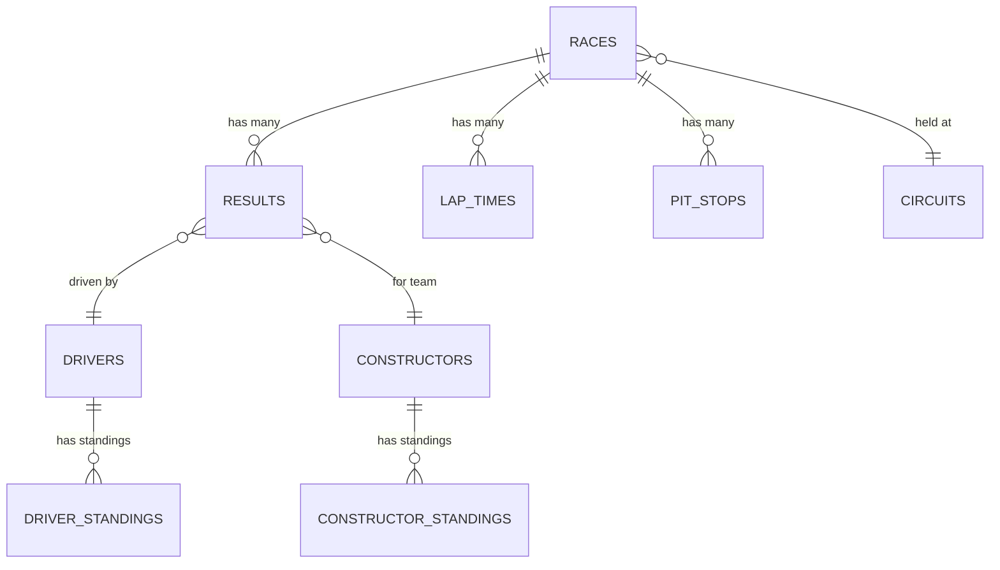

# Quickstart Guide

This guide will get you up and running with RaceData in just a few minutes. You'll learn how to download the data and start analyzing Formula 1 races.

## Installation & Setup

No special installation is required to use RaceData - just download the CSV files and start analyzing with your preferred tools.

<Tip>
  For Python users, we recommend installing pandas for easy data manipulation:
  ```bash
  pip install pandas
  ```
</Tip>

## Step 1: Download the Data

Choose one of the following methods to access the RaceData dataset:

<Steps>
  <Step title="Direct Download (Recommended)">
    Download the latest consolidated data archive directly from GitHub releases:

    ```bash
    wget https://github.com/TracingInsights/RaceData/releases/latest/download/data.zip
    unzip data.zip
    ```

    This gives you all 18 CSV tables in a single download.
  </Step>

  <Step title="HuggingFace Datasets">
    Access the data through HuggingFace for seamless integration with ML pipelines:

    ```python
    from datasets import load_dataset

    # Load a specific table
    dataset = load_dataset("tracinginsights/RaceData", data_files="races.csv")
    ```
  </Step>

  <Step title="Programmatic Download with Python">
    Use the same approach as the RaceData automation scripts:

    ```python
    import kagglehub
    from pathlib import Path

    # Download from Kaggle
    path = kagglehub.dataset_download("jtrotman/formula-1-race-data")
    print(f"Data downloaded to: {path}")
    ```

    <Note>
      Requires Kaggle API credentials configured via `~/.kaggle/kaggle.json`
    </Note>
  </Step>
</Steps>

## Step 2: Load and Explore the Data

Once downloaded, you can immediately start working with the data using pandas or any CSV-compatible tool.

<CodeGroup>

```python Python (pandas)
import pandas as pd

# Load the races data
races = pd.read_csv('data/races.csv')

# Load driver information
drivers = pd.read_csv('data/drivers.csv')

# Load race results
results = pd.read_csv('data/results.csv')

# Quick preview
print(f"Total races: {len(races)}")
print(f"Total drivers: {len(drivers)}")
print(races.head())
```

```r R (tidyverse)
library(tidyverse)

# Load the data
races <- read_csv('data/races.csv')
drivers <- read_csv('data/drivers.csv')
results <- read_csv('data/results.csv')

# Quick summary
glimpse(races)
```

```javascript JavaScript (Node.js)
const fs = require('fs');
const csv = require('csv-parser');

const races = [];

fs.createReadStream('data/races.csv')
  .pipe(csv())
  .on('data', (row) => races.push(row))
  .on('end', () => {
    console.log(`Loaded ${races.length} races`);
  });
```

</CodeGroup>

## Step 3: Run Your First Query

Let's analyze some real Formula 1 data with a practical example.

### Example: Find the Most Successful Drivers

<CodeGroup>

```python Python
import pandas as pd

# Load necessary tables
drivers = pd.read_csv('data/drivers.csv')
results = pd.read_csv('data/results.csv')

# Merge results with driver information
driver_results = results.merge(
    drivers[['driverId', 'forename', 'surname', 'nationality']],
    on='driverId'
)

# Count wins (position = 1)
wins_by_driver = (
    driver_results[driver_results['position'] == '1']
    .groupby(['forename', 'surname', 'nationality'])
    .size()
    .reset_index(name='wins')
    .sort_values('wins', ascending=False)
)

# Display top 10 drivers
print("\nTop 10 Most Successful F1 Drivers by Race Wins:")
print(wins_by_driver.head(10).to_string(index=False))
```

```python Output
Top 10 Most Successful F1 Drivers by Race Wins:
  forename    surname nationality  wins
     Lewis   Hamilton     British   103
   Michael Schumacher      German    91
 Sebastian     Vettel      German    53
     Alain      Prost      French    51
     Ayrton      Senna   Brazilian    41
...
```

</CodeGroup>

### Example: Analyze Lap Times for a Specific Race

```python
import pandas as pd
import matplotlib.pyplot as plt

# Load lap times and drivers
lap_times = pd.read_csv('data/lap_times.csv')
drivers = pd.read_csv('data/drivers.csv')
races = pd.read_csv('data/races.csv')

# Get a specific race (e.g., 2024 Monaco GP)
monaco_2024 = races[
    (races['year'] == 2024) & 
    (races['name'].str.contains('Monaco', case=False))
]

if not monaco_2024.empty:
    race_id = monaco_2024.iloc[0]['raceId']
    
    # Get lap times for this race
    race_laps = lap_times[lap_times['raceId'] == race_id]
    
    # Merge with driver names
    race_laps = race_laps.merge(
        drivers[['driverId', 'code']], 
        on='driverId'
    )
    
    # Convert lap time to seconds
    race_laps['time_seconds'] = race_laps['milliseconds'] / 1000
    
    # Find fastest lap
    fastest = race_laps.loc[race_laps['time_seconds'].idxmin()]
    print(f"\nFastest lap: {fastest['code']} - {fastest['time']} (Lap {fastest['lap']})")
```

## Common Use Cases

<CardGroup cols={2}>
  <Card title="Performance Analysis" icon="chart-line">
    Track driver and constructor performance over time, identify trends, and predict future outcomes.
  </Card>
  <Card title="Pit Stop Strategy" icon="stopwatch">
    Analyze pit stop timings, durations, and their impact on race results.
  </Card>
  <Card title="Circuit Comparison" icon="flag-checkered">
    Compare performance across different circuits and identify track-specific patterns.
  </Card>
  <Card title="Historical Research" icon="clock">
    Explore how Formula 1 has evolved from 1950 to the present day.
  </Card>
</CardGroup>

## Understanding the Data Structure

The dataset uses relational keys to connect tables. Here are the main relationships:



<Tip>
  All ID fields (raceId, driverId, constructorId, etc.) are foreign keys that allow you to join tables together for comprehensive analysis.
</Tip>

## Next Steps

Now that you have the data loaded and understand the basics, explore these resources:

<CardGroup cols={3}>
  <Card title="Data Schema" icon="database" href="/schema/overview">
    Complete reference of all 18 tables and their columns
  </Card>
  <Card title="Analysis Guides" icon="lightbulb" href="/guides/data-analysis">
    Advanced queries and visualization examples
  </Card>
  <Card title="Data Access Methods" icon="plug" href="/data-access/programmatic">
    Programmatic access and integration options
  </Card>
</CardGroup>

## Need Help?

If you encounter any issues or have questions:

- Check the [GitHub Issues](https://github.com/TracingInsights/RaceData/issues) for common problems
- Visit the [TracingInsights contact page](https://tracinginsights.com/contact/) for support
- Join the F1 data community on [Reddit](https://www.reddit.com/r/TracingInsights/)

<Note>
  The data is updated automatically within 3 hours of each race. To get the latest data, simply re-download from the GitHub releases page.
</Note>